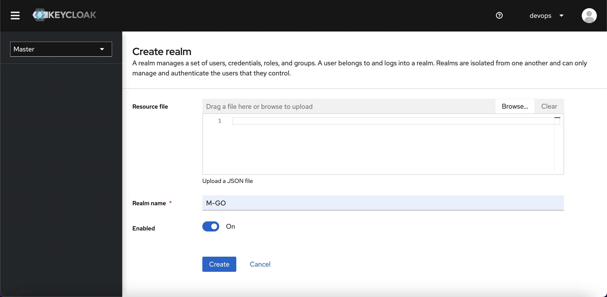
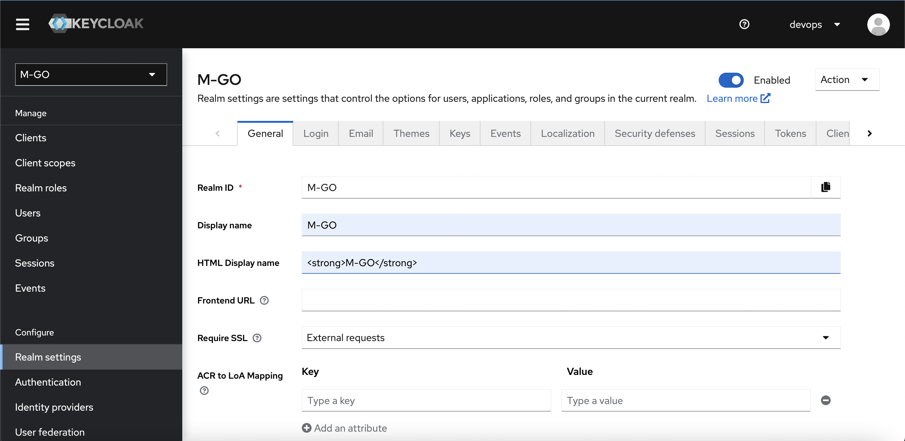
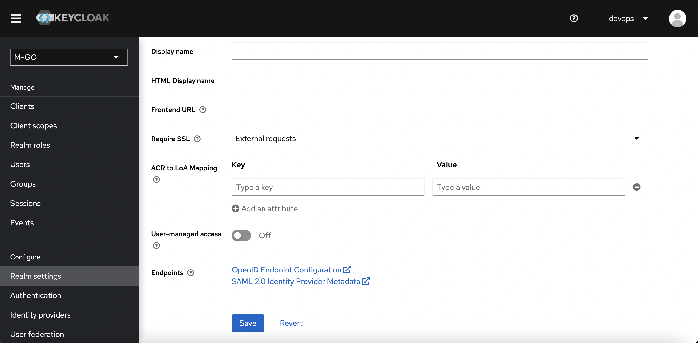

# Create M-GO Realm

Create a new Realm

# Realm settings

# Test
http://localhost:8082/realms/M-GO/protocol/openid-connect/auth?client_id=webapp&redirect_uri=http%3A%2F%2Flocalhost%3A8040%2Fadmin%2FM-GO%2Fconsole%2F%23%2F&state=4d539495-6778-40cd-a2e4-a231eb58d283&response_mode=fragment&response_type=code&scope=openid&nonce=51d722dd-dc27-4647-8c02-01b808459555&code_challenge=Uhp6_M2RpNY7gQ7w6TgPr2P_DWWiE3KGF_R6uTSZOC4&code_challenge_method=S256